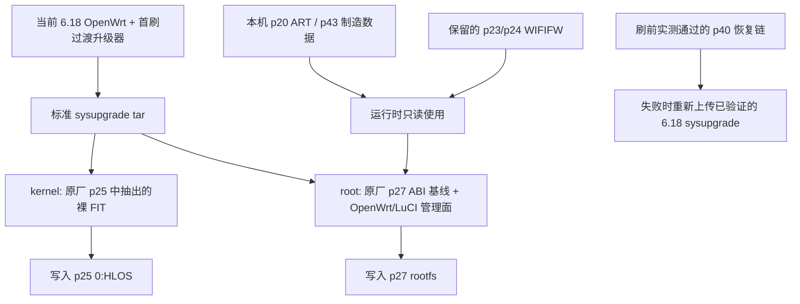

# SBE1V1K QSDK 12.2 原厂 ABI 兼容 OpenWrt/LuCI sysupgrade 方案

更新日期：2026-08-18

## 1. 最终目标

最终产物不是实验补丁，也不是只能手工写分区的 rootfs，而是一个标准的：

```text
sbe1v1k-qsdk12-stockabi-sysupgrade.bin
```

它应当能够通过仓库内受审计的首次过渡升级器，从当前已经运行且验证通过的 Linux 6.18 OpenWrt 刷入：

```sh
sbe1v1k-stockabi-firstflash-transition.sh --test  IMAGE TRUSTED_SHA256
sbe1v1k-stockabi-firstflash-transition.sh --flash IMAGE TRUSTED_SHA256
```

刷入后同时提供：

- 原厂 Linux 5.4.213 内核和原厂设备树；
- 原厂同版本的 SSDK、NSS-DP、PPE、PPE-VP、PPE-DS、ECM；
- 原厂 qca-wifi、CNSS2、QCN9224 三频无线和 PPEDS 数据路径；
- 标准 OpenWrt 的 UCI、netifd、dnsmasq、firewall、Dropbear、rpcd、uhttpd；
- LuCI 管理界面；运行时包管理只有在 stock ABI 包数据库逐包对账完成后才启用；
- 不启动 Spectrum/Askey Web、OpenSync、Plume、CUJO、SamKnows、Ookla、云控、遥测和厂商远程升级。

当前文档描述的是构建和验收规范。只有生成镜像、完成离线检查并通过真机启动与数据面测试后，才算达到最终目标。

## 2. 核心结论

这个目标可行，但首版不能以“公开 QSDK r6 重编内核，再随意复制几个原厂 `.ko`”的方式实现。

原厂发布实际是：

```text
OpenWrt:          19.07-SNAPSHOT r0+43-ac77edb2e
OpenWrt commit:   ac77edb2edf0b7770bef36bec016903a7902af72
SDK:              SPF12.2CUS2 / SPF12.2CSU2
APPS:             NHSS.QSDK.12.2.r6-00023-P-1
Kernel:           5.4.213
WLAN:             WLAN.WBE.1.1.r7-00022
NSS firmware:     None
```

原厂模块虽然都显示：

```text
vermagic=5.4.213 SMP preempt mod_unload aarch64
```

但编译路径含 `gac77edb-dirty`。目前无法证明公开 CodeLinaro r6 与原厂 `r6-00023-P-1` 是 bit-identical 源树。相同内核版本和 vermagic 不能保证内核配置、结构体布局、导出符号和驱动私有接口一致。

因此首版采用当前风险最低的主线：

> 把原厂同槽内核 FIT、完整 `/lib/modules/5.4.213`、QCA 无线/PPE 用户态和它们的动态库视为一个不可拆分的“原厂 ABI 岛”；在这个 ABI 岛外替换厂商控制面，加入标准 OpenWrt 管理组件和 LuCI。

这里常说的“原厂闭源 NSS 功能”，在这台 IPQ9574 上实际不是另一个可提取的 NSS 固件。`VerInfo.txt` 明确记录 `NSS: None`。数据面由主机侧 `qca-nss-dp`、`qca-nss-ppe*`、ECM、qca-wifi PPEDS 和 WIFIFW 协同完成。

## 3. 最终镜像结构



sysupgrade 只能写：

| 目标 | GPT 标签 | 大小 | 内容 |
| --- | --- | ---: | --- |
| kernel | `0:HLOS`，p25 | 7 MiB | 原厂 HLOS 中偏移 `0x3000` 的内层 FIT |
| root | `rootfs`，p27 | 122 MiB | 新的 SquashFS rootfs |
| overlay header | `rootfs_data`，p29 | 512 MiB | 使用 `-n` 时只清前 4 KiB |

绝不能写入 p20 ART、p21 ETHPHYFW、p22 LICENSE、p23/p24 WIFIFW、p36/p37 TLS、p39 厂商保留区、p40 chainloader、p43 ASKEYMFC、GPT、boot0/boot1 或任何启动链分区。

## 4. 已核验输入

### 4.1 原厂 dump

输入目录：

```text
/Users/yangzhg/Downloads/SBE1V1K-1.1.3.1-eMMC-backup-20260808
```

关键镜像：

| 镜像 | SHA-256 | 说明 |
| --- | --- | --- |
| `mmcblk0p25.img` | `5717e40e7a52a3876aee223ede2004886947e0803d8f967f35f1a00548aad3e5` | 2026-01-05 原厂 HLOS，新槽 |
| `mmcblk0p27.img` | `8488a757a29b05ef66393b25504ddc3e9dcc82041c46e217949300a68ee4818c` | 与 p25 配套的原厂 SquashFS |
| `mmcblk0p26.img` | `11df04296554a3c81990970cee53b43c7090ba434cb5fb87796b3065a1614eeb` | 2025-10-22 旧 HLOS |
| `mmcblk0p28.img` | `a61d0031f3787c72078e159dc89316056de2ed49f28f67cc5b3a5981bf058bc1` | 与 p26 配套的旧 rootfs |
| `mmcblk0p24.img` | `b03c9435d48796620a6aadfc4f90178c447a5bc11ba56ecdcf9be9636ca37c6d` | 新 WIFIFW |

p25 与 p27 是同一次发布，p26 与 p28 是另一发布。已经确认两个 rootfs 中的 `qca-ssdk.ko`、`qca-nss-ppe.ko` 等并不完全相同，禁止跨槽混搭。

### 4.2 原厂 HLOS 的真实格式

p25/p26 不是裸 FIT，而是 Qualcomm ELF/签名外壳，内层 FIT 从 `0x3000` 开始。p25 内层 FIT 已核验为：

```text
offset:   0x3000
size:     3801052 bytes (0x39ffdc)
SHA-256:  852030dc9e5d0b9e56845efd3a8decbde6dd93a7d779c84230331e244bfbb1bf
kernel:   ARM64 OpenWrt Linux-5.4.213
configs:          config@rtq7300t-rev0/rev1/rev2
first compatible: qcom,ipq9574-ap-al02-c4
board aliases:    askey,rtq7300t-rev0/rev1/rev2
```

当前 p40 chainloader 和已验证的 OpenWrt sysupgrade 使用裸 FIT，所以 `kernel` 成员必须是这个内层 FIT，不能把 7 MiB 外层 HLOS 原样当作 sysupgrade 的 kernel。抽掉的仅是外层签名容器，内核、原厂 DTB 和 FIT 内部内容不修改。

### 4.3 当前已验证 sysupgrade 的封装契约

参考镜像：

```text
/Users/yangzhg/Downloads/openwrt-qualcommbe-ipq95xx-askey_sbe1v1k-squashfs-sysupgrade.bin
```

```text
SHA-256: 5bd0cf45260464dc1c2f39361a03cc2634b1724494d6b1750816aa207203aaa2
format:  POSIX tar + fwtool metadata
members:
  sysupgrade-askey_sbe1v1k/CONTROL
  sysupgrade-askey_sbe1v1k/kernel
  sysupgrade-askey_sbe1v1k/root
```

新镜像必须保持同一封装、同一 `BOARD=askey_sbe1v1k` 和同一目标分区。metadata 的 `supported_devices` 同时包含当前 6.18 的 `askey,sbe1v1k`、刷入后 QSDK 识别的 `qcom,ipq9574-ap-al02-c4` 和原厂 rev0 alias `askey,rtq7300t-rev0`。首个跨基线升级必须使用 helper 固定的 `sysupgrade -n`，不能保留 Linux 6.18/OpenWrt 新版配置。

2026-08-17 对当前 192.168.1.1 做了只读复核：p23 与 p24 的完整分区 SHA-256 均为 `b7584b9538ee2c08386c51f883563879d7670db54c3964fcfd2418f2f17ebde1`，两槽内容相同；其 `VerInfo.txt` 仍是本节所列 APPS/WLAN 版本。这个 hash 与 dump p24 的整分区 hash 不同，所以构建不能假定 dump WIFIFW 就是当前真机逐字节副本。首版继续使用真机现存 p23/p24，不把 dump p24 写回设备。

## 5. 原厂二进制使用矩阵

### 5.1 必须原样保留的内核 ABI 岛

以下内容必须全部来自 p25+p27 同槽，不能挑几个模块复制：

- p25 内层 FIT，包括原厂 Linux 5.4.213 和 rev0/rev1/rev2 DTB；
- p27 的整个 `/lib/modules/5.4.213/`；
- `/etc/modules.d/`、模块加载顺序和必要的 sysctl；
- `qca-ssdk.ko`、`qca-nss-dp.ko`、`qca-nss-ppe.ko`；
- `qca-nss-ppe-vp.ko`、`qca-nss-ppe-ds.ko` 和 PPE manager 模块；
- `ecm.ko`、`ecm-wifi-plugin.ko` 及其完整依赖；
- `ipq_cnss2.ko`、`qdf.ko`、`umac.ko`、`qca_ol.ko`、`wifi_3_0.ko`；
- cfg80211、netfilter、bridge、crypto、PHY 等被上述模块依赖的同槽模块；
- 如果需要相应功能，保留原厂 EIP、MACsec、IPsec、spectral、pktlog 等模块。
- p27 的 `/lib/firmware/ifpp.bin`、`ipue.bin`、`ofpp.bin`、`opue.bin`，作为 EIP crypto 模块配套微码。

不能用公开 r6 重编的某一个模块替换原厂模块，也不能给原厂内核安装公开 feed 的 kmod。

### 5.2 必须保留的 QCA 用户态和脚本

首版直接沿用 p27 中的实际二进制和依赖闭包：

```text
/usr/bin/cnssdaemon
/usr/bin/cnsscli
/usr/sbin/hostapd
/usr/sbin/hostapd_cli
/usr/sbin/wpa_supplicant
/usr/sbin/wpa_cli
/usr/sbin/acfg_tool
/usr/sbin/acfg_set_profile
/usr/sbin/wlanconfig
/usr/sbin/wifitool
/usr/sbin/cfg80211tool
/usr/sbin/qca_gensock
/usr/sbin/ssdk_sh
/usr/sbin/ppecfg
/sbin/mf_tool
/sbin/wifi
/lib/wifi/
```

并保留它们实际依赖的原厂库，例如：

```text
libnl-3.so.200
libnl-genl-3.so.200
libnl-route-3.so.200
libnl-ppe.so
libqmi_cci.so
libqmi_common_so.so
libqmi_qrtr_cci.so
libacfg.so
libqca_tools.so
libqca_nl80211_wrapper.so
```

原厂 QCA hostapd/wpa 带有私有 nl80211 扩展。首版不能替换成普通 OpenWrt hostapd，否则三频基本 AP 功能可能能启动，但 QCA 特性、PPEDS 配置或控制接口会缺失。

以下启动链同样先原样保留：

```text
wifi_fw_mount
sysfixtime
license-pfm
load_cnss2
qca-acfg
qcawifi-config-cmd
qca-hostapd
qca-wpa-supplicant
qca-ssdk
qca-nss-dp
qca-nss-ecm
wifi_fw_done
```

其中 `license-pfm` 从 p22 `0:LICENSE` 读取 PFM 文件并链接给 QCN9224；它属于无线启动依赖，不是 Spectrum 云许可证服务，首版不能删除。

`qca-nss-ppe-ds.ko` 仍由原厂 `modules.d` 加载，但 p27 的 `/etc/init.d/qca-nss-ppe-ds` 原本没有 `rc.d` 启动链接。首版保持这一原始状态，不能为了追求“更多 NSS”擅自启用该服务脚本。

### 5.3 留在设备原分区、运行时只读使用的内容

| 分区 | 用途 | 策略 |
| --- | --- | --- |
| p20 `0:ART` | 每台设备 MAC、三张 QCN9224 校准数据 | 只读，永不进 sysupgrade |
| p21 `0:ETHPHYFW` | Ethernet PHY 固件 | 原位保留 |
| p22 `0:LICENSE` | QCN9224/PFM license 数据 | 由 `license-pfm` 只读使用，永不重刷 |
| p23/p24 `0:WIFIFW*` | IPQ9574 WCSS、QCN9224 FW/BDF/regdb | 原位只读挂载，首版不重刷 |
| p31/p32、p35、p42 | 厂商配置、应用和用户数据 | 保留分区但新系统默认不挂载 |
| p36/p37 | 设备证书、身份和私钥 | 不读取进构建目录、不发布、不写入 |
| p43 `0:ASKEYMFC` | 硬件版本/TN/制造数据 | 原位读取，永不打包 |

dump 的 p20 ART 与当前真机 p20 已确认不是同一份设备身份和校准数据。因此即使构建私有镜像，也不能把 dump 的 ART、MAC、caldata 或 ASKEYMFC 放进 sysupgrade。运行时必须读取当前这台设备自己的分区。

原厂校准映射为：

```text
PCIe1 / 2.4 GHz: ART offset 0x58800, length 0x2d000
PCIe2 / 6 GHz:   ART offset 0x8a800, length 0x2d000
PCIe3 / 5 GHz:   ART offset 0xbc800, length 0x2d000
```

BDF 有 4.0、4.1、4.2 等硬件版本，5/6 GHz RF filter BOM 不同。首版保留原厂 `mf_tool + wifi_fw_mount` 选择逻辑，使其读取本机硬件版本；后续才能用开源的只读解析器替代 `mf_tool`。

### 5.4 从 QSDK/OpenWrt 源码构建的管理面

首版保留 p27 已经配套运行的 BusyBox、procd、ubusd/ubus、UCI、netifd、firewall3/iptables、fstools 和底层库；它们本身属于 OpenWrt 用户空间，同时可避免无必要地扰动 QCA 启动链。已核验 stock ABI 为 musl 1.1.24、`libubus.so.20210603`、json-c SONAME 2、OpenSSL 1.1 和 libnl SONAME 200。

以下缺失或必须替换的组件从与 QSDK 12.2/OpenWrt 19.07 ABI 匹配的源代码构建：

- rpcd、uhttpd、uhttpd-mod-ubus；
- LuCI 19.07 的 `luci-base`、`luci-mod-admin-full`、`luci-theme-bootstrap`；
- `luci-app-firewall`；`luci-app-opkg` 仅在未来 release 包数据库对账完成后评审；
- Lua、ubus/uci Lua binding、luci-lib-nixio 等依赖；
- 标准 Dropbear，用来替换原厂 2019.78 二进制和厂商密钥逻辑；
- 同一 QSDK 构建的 dnsmasq 包，用来补齐标准 init/config 并替换母版二进制；
- `libiwinfo`/Lua/rpcd iwinfo 后端；`odhcpd` 留到后续 IPv6 阶段；

首版以 p27 rootfs 为母版，不覆盖已经存在且被 QCA 二进制使用的共享库。每个新 ELF 都要先检查 `NEEDED` 和符号版本；必要时以提取出的 p27 作为 link sysroot。如果新包要求覆盖 libc、libubus、libuci、libnl 或 OpenSSL，则暂停覆盖并采用同版本构建，不能用 `--force-depends` 掩盖 ABI 问题。

现代 OpenWrt 25.x/26.x 的 apk、firewall4、ucode LuCI 和二进制包不能直接装入这个 19.07/QSDK rootfs。

### 5.5 必须停止的厂商控制面

首版先禁用启动项，确认核心硬件无依赖后再从 SquashFS 删除文件：

- Spectrum/Askey Web CGI 和 `lighttpd`；
- OpenSync/Plume 和其云管理；
- CUJO；
- SamKnows、Ookla；
- 厂商远程升级、遥测、健康上报和 crash upload；
- `default_ssid_key` 和基于序列号修改 root 密码的逻辑；
- 原厂 Dropbear 服务及其密钥；
- 与云端身份有关的 `secure_key`、`sstorage`、证书注册流程。
- `update_vendor_data`，因为它会通过 `mf_tool WRITE_*` 改写制造数据；
- `verify_ib`，因为它可能写入或恢复 TLS/身份分区；
- `iot_upgrade`、`boot-ftm` 和其他生产、老化、调试入口；第 8.7 节列出的两项硬件兼容例外除外。

第一轮不要删除风扇、温控、GPIO、电源管理进程。必须保留 `askey_pwm`、`askey_pwm_check`、`askey_pwm_sig`、`libsuci.so`、`askey_pwm.script`、`thermaltool`、`thermald`、PWM/thermal 配置和 `led_ctl` 的完整闭包；它们会根据多个温区控制风扇并可能调整 radio chainmask。只有标准 PWM/thermal 驱动通过温升和射频压力测试后才能替换。Thread/BLE/MG21 服务也应作为独立可选功能处理，不能和 QCA PPE/Wi-Fi 核心一起盲删。

## 6. 为什么先重制原厂 rootfs，而不是立即做“全新公开 r6 rootfs”

最短且成功率最高的第一阶段是：

```text
p25 原厂内层 FIT（不修改）
        +
p27 原厂 rootfs（保留 ABI 岛，替换管理面）
        +
LuCI/OpenWrt 19.07 兼容包
```

这样能保留原厂未公开的 dirty patch、模块布局、动态库和启动顺序，同时把用户可见控制面改成标准 OpenWrt。

第二阶段才是：

```text
公开 NHSS.QSDK.12.2.r6 统一重编 kernel + 所有 kmod
        +
只复用 WIFIFW/BDF/逐机校准
        +
尽可能少的 QCA 闭源用户态
```

第二阶段更干净，但在公开源码不能复现原厂 `ac77edb-dirty` 差异之前，不能保证所有原厂闭源功能完整。

## 7. QSDK 12.2 源码基线

官方 manifest 仓库：

<https://git.codelinaro.org/clo/qsdk/releases/manifest/qstak>

与原厂 `r6-00023-P-1` 对齐的 manifest：

```text
AU_LINUX_QSDK_NHSS.QSDK.12.2.R6_TARGET_ALL.12.02.06.2230.023.xml
```

在 WSL2 ext4 中同步：

```sh
export SBE_QSDK_SRC=$HOME/src/qsdk-12.2-r6
mkdir -p "$SBE_QSDK_SRC"
cd "$SBE_QSDK_SRC"

repo init \
  -u https://git.codelinaro.org/clo/qsdk/releases/manifest/qstak \
  -b release \
  -m AU_LINUX_QSDK_NHSS.QSDK.12.2.R6_TARGET_ALL.12.02.06.2230.023.xml \
  --repo-url=https://git.codelinaro.org/clo/tools/repo \
  --repo-branch=qc-stable \
  --no-clone-bundle

repo sync -j"$(nproc)" --detach --no-tags
repo manifest -r -o manifest.lock.xml
```

以上命令只负责取得并锁定源码，不等于已经得到可直接运行 `make` 的完整 buildroot。本轮 macOS 环境没有实际完成该 manifest 的 checkout，因此 openwrt workspace 的真实路径、`openwrt-patches` 应用入口、设备 profile、LuCI feed revision 和 package 输出目录都必须在 WSL 首次 `repo sync` 后按树内 README/脚本核对并记录。找到真实 workspace 后将它记为 `SBE_QSDK_BUILD`；`manifest.lock.xml` 始终使用 `$SBE_QSDK_SRC/manifest.lock.xml`。未完成这一步前，管理包目录和 `management-root` 都是待生成输入，不能写成已经存在的产物。

已核验的关键公开 revision：

| 组件 | revision |
| --- | --- |
| linux-ipq-5.4 | `e2bb17c4a1c8182d65b54e12c39a2613a92c764d` |
| openwrt_repo | `e71632be5197770b6339ea9f88b5e7b65e87cf53` |
| openwrt-patches | `38cd43ed92e957aa2e85e201d9bacf44cc56ee57` |
| qca-ssdk | `5fc7e5b726271faa492e7b2bfb8a85232c9a292a` |
| nss-dp | `7a602da9ea32b705fff5bce6cfee89b172a62c0d` |
| nss-ppe | `6b87f77441fc3c3f6c467fa01b0dd8b8abc1b64d` |
| qca-nss-ecm | `0fe0ed529cd265342f89921f6b2534cd0491b44f` |
| qca-wifi-oss | `9e8510f277e412b3c7ad52966e9fa7d313e8559b` |
| qca-cnss | `d39e3a3be9208c12330a0bf59f96c5104e12def6` |

这些 revision 用于构建兼容的 LuCI/OpenWrt 管理面，并作为第二阶段全源码路线的基线。第一阶段不使用其中重编出的 kernel/kmod 替换原厂 ABI 岛。

## 8. WSL2 构建流程

### 8.1 文件系统要求

所有提取和构建必须在 WSL2 的 ext4 home 下进行，不能在 `/mnt/c` 中解包。原厂 rootfs 同时存在例如 `xt_DSCP.ko` 和 `xt_dscp.ko`，大小写不敏感文件系统会造成静默覆盖或解包失败。

```sh
export SBE_DUMP_DIR=/mnt/c/Users/yangzhg/Downloads/SBE1V1K-1.1.3.1-eMMC-backup-20260808
export SBE_WORK_DIR=$HOME/src/sbe1v1k-qsdk12-stockabi

mkdir -p "$SBE_WORK_DIR"/{input,rootfs,output,manifests,packages}
cd "$SBE_DUMP_DIR"
sha256sum -c SHA256SUMS
```

只复制需要的通用镜像，不复制身份分区：

```sh
cp "$SBE_DUMP_DIR/mmcblk0p25.img" "$SBE_WORK_DIR/input/"
cp "$SBE_DUMP_DIR/mmcblk0p27.img" "$SBE_WORK_DIR/input/"
```

### 8.2 从 p25 提取裸 FIT

```sh
cd "$SBE_WORK_DIR"

FIT_HEX=$(xxd -p -s 0x3004 -l 4 input/mmcblk0p25.img)
FIT_SIZE=$((16#$FIT_HEX))

dd if=input/mmcblk0p25.img \
   of=input/stock-kernel.itb \
   iflag=skip_bytes,count_bytes \
   skip=$((0x3000)) count="$FIT_SIZE"

test "$(xxd -p -l 4 input/stock-kernel.itb)" = d00dfeed
test "$(sha256sum input/stock-kernel.itb | awk '{print $1}')" = \
  852030dc9e5d0b9e56845efd3a8decbde6dd93a7d779c84230331e244bfbb1bf

dumpimage -l input/stock-kernel.itb
```

如果 hash 不一致，立即停止，不能通过修改期望值继续。

### 8.3 提取 p27 rootfs

```sh
cd "$SBE_WORK_DIR"
rm -rf rootfs/stock
unsquashfs -lln input/mmcblk0p27.img > manifests/stock-squashfs-list.txt

# 原厂镜像唯一的设备节点必须是 /dev/console，类型和权限必须为 c 5:1,0600。
grep -E '^crw-------[[:space:]]+[^[:space:]]+[[:space:]]+5,1[[:space:]].*squashfs-root/dev/console$' \
  manifests/stock-squashfs-list.txt

# 普通 WSL 用户不能创建字符设备；先只排除已经验证的这一项，其余错误必须失败。
printf '%s\n' dev/console > manifests/stock-squashfs-exclude.txt
unsquashfs -no-progress \
  -d rootfs/stock \
  -exclude-file manifests/stock-squashfs-exclude.txt \
  input/mmcblk0p27.img
test -x rootfs/stock/init
test -d rootfs/stock/lib/modules/5.4.213

(cd rootfs/stock && \
  find . -xdev -type f -print0 \
    | sort -z \
    | xargs -0 -r sha256sum) \
  > manifests/stock-rootfs.sha256

(cd rootfs/stock && \
  find lib/modules/5.4.213 -type f -name '*.ko' -print0 \
    | sort -z \
    | xargs -0 sha256sum) \
  > manifests/stock-kmods.sha256
```

这里的删除只发生在专用构建目录中，dump 输入保持只读。构建脚本执行前还应检查 `SBE_WORK_DIR` 不为空且位于 WSL home。

不能直接忽略任意 `unsquashfs` 错误。构建器会先从数值 UID/GID 结构清单确认只有 `/dev/console` 这一个设备节点，使用 `-exclude-file` 只排除它，要求其余提取正常返回 0，并比较提取前后的普通文件、目录和软链接结构；打包时通过 `mksquashfs -p` 精确重建设备节点。这样不需要以 root 身份运行整个构建，也不会漏掉其他提取失败。

### 8.4 构建 LuCI 和标准管理包

本节是 WSL 首次同步后需要落地并锁定的 package recipe，不是已经验证可直接复制执行的命令。先按树内说明确认实际 OpenWrt workspace、patch 入口、`ipq95xx/generic` profile、AArch64 Cortex-A73 目标和 LuCI feed revision，再构建：

```text
luci-base
luci-mod-admin-full
luci-mod-network
luci-mod-status
luci-mod-system
luci-theme-bootstrap
luci-app-firewall
rpcd
uhttpd
uhttpd-mod-ubus
lua
libubus-lua
libuci-lua
luci-lib-nixio
dropbear
dnsmasq
libiwinfo
libiwinfo-lua
rpcd-mod-iwinfo
rpcd-mod-file
```

`luci-app-opkg` 不进入当前 candidate：stock 包数据库尚未完成逐包对账，运行时 feed 也被禁用。只有 reconciliation lock、ABI 岛 hold 和同锁 feed 排除规则实现后，才重新评审包管理界面。

确认并提交 `.config`/feed lock 后，只编管理包，不编或安装公开 r6 kernel/kmod。下面命令是入口示意，不能把未 pin 的 `feeds update -a` 结果当作锁定输入：

```sh
./scripts/feeds update -a
./scripts/feeds install -a
make defconfig
make package/luci/compile V=s
make package/system/rpcd/compile V=s
make package/network/services/uhttpd/compile V=s
make package/network/services/dropbear/compile V=s
```

具体 feed 路径和 package target 以 manifest 中的 QSDK tree 为准。所有生成的 `.ipk`、`.config`、feed revision 和 `manifest.lock.xml` 都要保存到构建记录中。

这里的 `iwinfo` 必须来自同一 QSDK 12.2/OpenWrt 19.07 构建，并验证其 nl80211 后端能读取原厂 qca-wifi；不能拿现代 OpenWrt 的包替换。每个依赖包名都必须写入 `configs/sbe1v1k-stockabi-packages.txt`，其唯一对应 IPK 同时放入 `--ipk-dir`；构建器不会从目录自动递归选择依赖。首版明确只保证 IPv4，默认配置不创建 `wan6`，也不设置 LAN `ip6assign`；后续启用 IPv6 时再加入同锁的 `odhcpd-ipv6only` 及其完整依赖。

### 8.5 将管理包加入原厂 rootfs

以 p27 为母版加入管理包，而不是把 dump 二进制复制到未经验证的现代 rootfs。但不能直接对 p27 执行 `opkg --offline-root install`：已核验原厂 `/usr/lib/opkg/status` 没有正常的 Package/Status 记录，`info/` 也只剩极少 control 文件。离线 opkg 会把已经存在的 libc、libubus、libuci 等误判为未安装，从而覆盖 ABI 岛。

安全流程是：

1. 由同一 QSDK buildroot 生成一个包含同版基础包和所需管理包、依赖及完整 opkg 数据库的临时 `management-root`；该 root 只能作为对账输入，不能因记录数量足够就直接当作 stock 的已安装数据库；
2. 分别导出每个 `.ipk` 的 control 和 data 清单；
3. 先生成与 stock rootfs 的碰撞报告；
4. 只复制无冲突文件，或对经过 ELF/符号验证的冲突逐项建立 allowlist；
5. 将 `status` 和每个已安装包对应的 `info/*.control`、`*.list`、`*.conffiles` 一起合入最终 root；只有 status、没有文件清单的数据库仍然不可用；
6. 对每个准备沿用 stock 满足依赖的包，核对 version、architecture、文件类型、`.list` 中每个路径及关键文件 hash；公开 QSDK root 中存在、但 stock p27 中不存在或内容不同的 payload 不能算“已安装”；
7. 对 kernel、全部 kmod、libc、fstools、QCA 模块/库和其他 ABI 岛包建立逐包 immutable/hold 记录，并从可用 feed 排除；一个笼统的 `sbe1v1k-stock-abi` 元包不能满足 versioned dependencies，也不能代替真实包记录；
8. 默认拒绝 `--force-depends` 和 `--force-overwrite`。

安装前后必须生成文件清单。若任何 payload 准备覆盖以下文件，先停止并做 ABI 审计：

```text
/lib/ld-musl-aarch64.so.1
/lib/libubus*
/lib/libuci*
/usr/lib/libnl-3.so.200*
/usr/lib/libnl-genl-3.so.200*
/usr/lib/libssl.so.1.1
/usr/lib/libcrypto.so.1.1
```

首版 opkg feed 只能提供同一 QSDK lock 构建的用户态包，并明确排除 `kernel`、所有 `kmod-*`、libc、动态加载器和 QCA ABI 岛。不能用 `--force-overwrite` 或 `--force-depends` 作为常规解决办法。

如果构建时只有原厂残缺的 opkg status，产物只能标记为实验 candidate，必须移除 `luci-app-opkg`、禁用在线 feed，并拒绝在设备上执行包升级；它不能作为本项目的最终 release 镜像。仅提供一个公开 QSDK `--base-opkg-root` 也不自动解除这一限制：在逐包 reconciliation lock 和 stock payload 校验实现前，它仍然只是审计输入，不能让缺失的 Lua、资源或 iwinfo payload 通过依赖检查。

### 8.6 修复 preinit 和持久 overlay

这是首版的硬门槛。原厂 p27 不能原样使用：

- `lib/preinit/80_mount_root` 注释了标准 `mount_root`，却会主动检查并格式化 p29 `rootfs_data` 和 p30 `rootfs_data_1`；
- `lib/preinit/42_mount_askey_partition` 会挂载厂商分区，并在挂载失败时格式化 p33、p34、p35、p38、p42；
- `lib/preinit/01_default_configs` 把 `/etc/config`、`/lib/firmware`、`/lib/wifi` 等 bind 到 tmpfs，导致 LuCI/UCI 配置重启后丢失。

构建时必须：

1. 删除 `42_mount_askey_partition` 的 hook，禁止新系统自动挂载或格式化任何厂商数据分区；
2. 删除 `01_default_configs` 的 tmpfs overlay 逻辑；
3. 保留与原厂 rootfs 同 ABI 的 `/sbin/mount_root`/`libfstools`；已从二进制确认它支持 `rootfs_data`、ext4 和 overlayfs。用安全的 preinit hook 调用它，不能混入现代 OpenWrt 的 fstools 二进制；
4. 安全 hook 必须按 GPT label 解析并确认唯一的 `rootfs_data`，同时确认它是 p29；只有 p29 开头 4 KiB 全为零时，才可把它视为 `sysupgrade -n` 明确清除后的分区并初始化为 ext4。没有可识别文件系统但又不是这个零标记时必须拒绝，不能凭一次 `blkid` 失败就格式化；
5. 明确拒绝 `rootfs_data_1`、log、persist、usr_app、tls、backup_tls、bypass_cert 和 user_data；
6. 验证 `/etc/config`、`/etc/dropbear`、opkg 状态和 LuCI 设置都实际落在 p29，并通过冷重启持久化。

最终 preinit 中不得存在针对 p30、p33、p34、p35、p36、p37、p38、p39、p40、p42、p43 的 `mkfs`、`dd` 或读写 mount。只有 `sysupgrade -n` 后首次启动时格式化 p29 是允许的。

原厂这版 fstools 的配置恢复契约不是“把 gzip 直接写到 p29”。未来若实现保存配置，stage2 必须先验证 p29、创建 ext4、临时挂载，再把备份复制成分区根目录的 `/sysupgrade.tgz`；下次启动由原厂 fstools 把它移入 overlay 并恢复。通用新版 `emmc_copy_config` 对 p29 执行 raw `dd` 会被首次启动格式化掉，禁止使用。当前 v1 无论跨基线还是同基线升级都强制 `sysupgrade -n`；在该 ext4 契约完成实现和真机验证前，不支持保存配置。

### 8.7 重建启动服务

不要沿用原厂 `/etc/rc.d` 全部链接。构建脚本应先生成一份显式 allowlist，再启用服务。

对保留的 QCA 服务必须复用原厂 `START` 值和相对顺序；allowlist 只决定是否启用，不能按列表顺序重新编号。尤其不能交换 WIFIFW、CNSS2、PFM license、qca-wifi、PPE/ECM 的启动时序。

核心保留组：

```text
wifi_fw_mount
license-pfm
load_cnss2
qca-acfg
qcawifi-config-cmd
qca-hostapd
qca-wpa-supplicant
qca-ssdk
qca-nss-dp
qca-nss-ecm
wifi_fw_done
01_skb_recycler
rngd
sysctl
syslog
system
powerctl
thermal
askey_pwm
```

标准 OpenWrt 管理组：

```text
network
firewall
dnsmasq
dropbear
ssh-hostkey-fingerprint
rpcd
uhttpd
cron
```

首版只保证 IPv4，因此不启用 `odhcpd`；后续加入同锁 `odhcpd-ipv6only` 及完整依赖后再启用 IPv6。

明确禁用组：

```text
lighttpd
opensync
openvswitch
cujo-user
samknows
ookla
iot_upgrade
healthcheck
update_vendor_data
default_ssid_key
process_crash_dump
secure_key
sstorage
verify_ib
```

原厂 `/etc/init.d/boot` 不能整体删除或直接换成通用脚本，因为它还负责 `mount_root`、tmpfs/debugfs、早期 `kmodloader`、`firmware_rdp_feature.ini`、board detect、6 GHz MAC 和若干 IPQ9574 初始化。应以原厂 p27 脚本为底稿做一份可审计的 `boot-stockabi`，保留这些硬件段，只删除或改写：

- 根据序列号执行 `passwd root`；
- `/tmp/shadow`、原厂 TLS 和厂商账户处理；
- `dnsmasq disable`；
- OpenSync/Open vSwitch 专用的 `ovs_enabled=1` 强制设置；
- `dmesg -n 1` 等隐藏启动错误的处理；
- 云控和远程升级调用。

禁用 rc.d 链接还不够。还必须替换 `/etc/init.d/firewall`、`/etc/udhcpc.user`、`/etc/ppp/ip-up`、`/etc/ppp/ip-down`、`/sbin/reboot`、`/etc/crontabs/root`、`/etc/profile`、`/etc/sysctl.conf` 和 `/etc/sysupgrade.conf` 中绕过 rc.d 直接调用 OpenSync/崩溃上传的入口；最终对这些核心路径做字符串扫描。旧的 `/usr/lib/lua/luci`、`/usr/share/luci` 和 `/www` 也要先清空，再只安装本次构建的 LuCI，避免保留原厂 Thread Web 页面和宽松权限文件。

`/sbin/reload_config` 是标准 procd 配置通知逻辑，必须保留，不能因名称相似而当成厂商云控删除。净化后的脚本要与标准 base-files boot 做逐段合并，而不是从空白重写。新系统首次启动生成 Dropbear host key；源码、rootfs 和 sysupgrade 中不得保存固定 root 密码、密码 hash 或私钥。

`SI_eye_diagram` 和 `ftm` 是首版的两项显式硬件兼容例外：前者保留原厂 PCIe/QSGMII signal-integrity tuning，后者暂时保留只读 ART/caldata 兼容链。它们不属于云控，但都必须记录启动日志和实际读写行为；后续分别以可审计的板级初始化和只读 caldata helper 替代。`boot-ftm` 工厂模式入口不启用。

原厂 `write_nssoffload` 两处调用本来就是注释状态；`qcawificfg80211.sh` 对 IPQ95xx 还明确设置 `wifi_nss_olcfg=0`。首版必须保持这一状态。这里要保留的是 PPE/PPEDS/ECM 数据路径，不是没有 firmware 支撑的旧式 Wi-Fi NSS offload。

### 8.8 网络和 LuCI 默认值

首版默认配置：

```text
LAN:             192.168.1.1/24
WAN:             DHCP client
LuCI/uhttpd:      只监听 LAN
SSH/Dropbear:     只允许 LAN，首登只接受构建者公钥
WAN input:        REJECT
Wi-Fi:            保留 QSDK 自动生成配置；首次管理和验收先使用有线 LAN
云服务:           全部关闭
```

`sysupgrade -n` 后不继承当前 root 密码。root 在镜像中保持 `*` 锁定；构建命令必须显式提供一把 SSH **公钥**，写入 `/etc/dropbear/authorized_keys`。首次从 LAN 以该公钥登录后执行 `passwd`，再开放 LuCI 密码登录。构建时不得写入预设密码、密码 hash 或私钥，也不能依赖当前聊天中使用过的设备密码。

母版中的 `/etc/dropbear/dropbear_*_host_key`、`/etc/uhttpd.key`/证书、lighttpd 自签名 PEM、`/usr/askey/server_rsakey.pem` 和 OpenSync/client 私钥必须在打包前删除；Dropbear host key 在首次启动后写入 p29 overlay。`ssh-hostkey-fingerprint` init 服务只调用 `dropbearkey -y`，把生成后的公开指纹打印到物理 UART，便于在电脑端更新 `known_hosts` 前做带外核对；它不输出或复制私钥。当前 audited uhttpd 配置仅启用 LAN HTTP，不自动生成或复用任何 TLS 私钥；HTTPS 留待独立证书配置后启用。

已核对当前 SBE1V1K 实机只有 1 个 WAN 和 3 个 LAN。原厂 5.4/QSDK 命名规则以 `eth0` 为 WAN、`eth1 eth2 eth3` 为三个 LAN。p27 自带的 `/etc/config/network` 只有 loopback，而通用 `01_network` 会把 AP-AL02-C4 误按参考板扩展为 `eth1 ... eth5`。最终镜像不能依赖这两个默认值，必须显式生成 legacy 19.07 配置：

```text
loopback: lo, static 127.0.0.1/8
lan:      bridge, ifname "eth1 eth2 eth3", static 192.168.1.1/24
wan:      ifname "eth0", DHCP client
```

`qcawifi-config-cmd` 会在缺少 `/etc/config/wireless` 时调用原厂 `/sbin/wifi config` 生成 QSDK legacy 配置。首版不虚构一个未经实机验证的 mac80211 `disabled=1` seed；第一次启动仍先从有线 LAN 管理，核对三张 radio 的 band、BDF 和 caldata 后，再决定最终 SSID/VAP 是否加入 `lan`。

原厂 p29/p30 使用 ext4，p27 已带 `mke2fs`、`mkfs.ext4` 和 `fsck.ext4`。`sysupgrade -n` 清除 p29 头部后，专用 preinit 只有在唯一 label、p29 分区号、无文件系统签名和前 4 KiB 全零同时成立时才重建 ext4，再由 stock fstools 挂载；这些工具以及原厂内核现有的 ext4 支持都属于首版必留能力。

使用 QSDK legacy qca-wifi UCI glue，即 `/sbin/wifi` 和 `/lib/wifi/qcawifi*.sh`。不要把现代 mac80211 的 netifd wireless backend 覆盖到这一版 qca-wifi 上。

### 8.9 为后续升级加入正确的平台脚本

本节四个文件是成品 rootfs 内置、供刷入后继续升级的栈。第一次从当前 6.18 跨基线时，这些文件尚未在运行系统中，必须使用 `scripts/sbe1v1k-stockabi-firstflash-transition.sh` 临时 bind `platform.sh`、`emmc.sh` 和 `do_stage2`；不得直接调用当前 6.18 的普通 writer。

新 rootfs 必须移植当前已验证的 label-based eMMC 升级逻辑：

```text
CI_KERNPART=0:HLOS
CI_ROOTPART=rootfs
CI_DATAPART=rootfs_data
```

原厂 FIT 三个 DTB 的第一 compatible 都是 `qcom,ipq9574-ap-al02-c4`，QSDK 的 `02_sysinfo` 会把它作为 board name；当前 6.18 是 `askey,sbe1v1k`，rev0 DTB 还包含 `askey,rtq7300t-rev0`。设备专用 `platform_check_image` 和 `platform_do_upgrade` 接受这三个已验证名称，但始终按 GPT label 解析设备，再核对分区号，不能把 `/dev/mmcblk0p25` 当作未经验证的输入。

原厂 `/sbin/sysupgrade` 不能保留。它在常规校验和 `-T` 之前就卸载 qseecom、删除 binding 数据，并进入厂商签名、trymode 和 BOOTCONFIG 流程。首版应只替换以下四个设备专用入口，同时继续使用原厂同 ABI 的 `common.sh`、`stage2`、`/sbin/upgraded`、validator、fwtool 和 jshn：

```text
/sbin/sysupgrade
/lib/upgrade/do_stage2
/lib/upgrade/platform.sh
/lib/upgrade/emmc.sh
```

新的 `sysupgrade -T` 只能做只读校验。validator 完成后还要执行一次不能被 `-F` 绕过的设备检查；进入 RAM stage2 后，写盘前再检查一次。eMMC helper 只接受标准 tar，不支持裸 FIT fallback，也不读 trybit/age/BOOTCONFIG。

首刷由电脑端可信的整镜像 SHA-256 保护；内置 writer 还固定校验原厂 kernel hash，但当前没有为每次构建变化的 root payload 嵌入独立可信 hash，fwtool metadata 也不是签名。因此后续同基线升级仍必须从可信构建记录取得 `.sha256`，传到路由器后先逐字节核对，再执行 `sysupgrade -T`。将 root hash 纳入签名 metadata 或固定 manifest 是 release 前的完整性待办。

`/sbin/sysupgrade` 在准备 RAMFS 前还必须确认 `/tmp` 可用空间至少为“镜像三倍”和 256 MiB 中的较大值、`/tmp/root` 不存在或为空，并在复制后核对 `upgraded` 可执行。若 ubus/RAMFS 阶段失败，操作者只能先完整重启再重试，不能手工清空 `/tmp/root` 后继续；这是避免空间耗尽或复用陈旧 writer 的失败关闭边界。

`platform_check_image` 至少检查：

- sysupgrade 只含 `CONTROL`、`kernel`、`root`；
- metadata 同时支持 `askey,sbe1v1k`、`qcom,ipq9574-ap-al02-c4` 和 `askey,rtq7300t-rev0`；
- kernel 是 FIT，且大小小于 `7 MiB - 4 KiB`；
- root 是 SquashFS，且大小小于 `122 MiB - 64 KiB`；
- `0:HLOS`、`rootfs`、`rootfs_data` 标签各自只出现一次，并分别核对为 p25、p27、p29；
- `rsvd_2` 唯一映射 p40，并且前 `758532` 字节匹配已测试 chainloader SHA-256；
- 不存在任何写 ART/WIFIFW/TLS/ASKEYMFC 的动作。

stage2 的固定写入顺序是：先把 p25 开头 4 KiB 置零并读回确认旧 FIT 已失效，完整写 p27 root、`sync` 并读回校验，只清除 p29 开头 4 KiB并读回校验，最后完整写 p25 FIT、`sync` 并读回校验。当前 v1 不存在保留配置分支。任何一步失败都不能退回通用 MTD 写入逻辑。

### 8.10 使用仓库中的受约束构建器

手工步骤用于解释格式，实际产物应由仓库中的构建器生成。它固定核对 p25/p27/FIT hash、QSDK manifest revision、包边界、ELF 依赖、原厂 ABI 文件 hash、私钥、设备节点、服务 allowlist、分区脚本和最终 tar metadata。

全新 clone 没有 host `fwtool`。先在本仓库 OpenWrt 树中构建它；同步 QSDK 后还必须按真实目录设置 buildroot、精选 IPK 目录和 `management-root`：

```sh
export SBE_REPO=$HOME/src/SBE1V1K
export SBE_QSDK_SRC=$HOME/src/qsdk-12.2-r6
export SBE_QSDK_BUILD=/absolute/path/to/verified-openwrt-buildroot
export SBE_QSDK_IPKS=/absolute/path/to/curated-qsdk-r6-ipks
export SBE_QSDK_ROOT=/absolute/path/to/verified-management-root
export SBE_OUT=$HOME/src/sbe1v1k-stockabi-output

cd "$SBE_REPO"
make defconfig
make tools/firmware-utils/compile V=s
if test -x "$SBE_REPO/staging_dir/host/bin/fwtool"; then
  export SBE_FWTOOL=$SBE_REPO/staging_dir/host/bin/fwtool
elif test -x "$SBE_REPO/staging_dir/hostpkg/bin/fwtool"; then
  export SBE_FWTOOL=$SBE_REPO/staging_dir/hostpkg/bin/fwtool
else
  echo 'fwtool build failed' >&2
  exit 1
fi

scripts/build-sbe1v1k-stockabi-sysupgrade.sh \
  --p25 "$SBE_DUMP_DIR/mmcblk0p25.img" \
  --p27 "$SBE_DUMP_DIR/mmcblk0p27.img" \
  --ipk-dir "$SBE_QSDK_IPKS" \
  --qsdk-manifest "$SBE_QSDK_SRC/manifest.lock.xml" \
  --admin-public-key "$HOME/.ssh/id_ed25519.pub" \
  --openwrt-tree "$SBE_REPO" \
  --fwtool "$SBE_FWTOOL" \
  --base-opkg-root "$SBE_QSDK_ROOT" \
  --work-dir "$HOME/src/sbe1v1k-stockabi-work" \
  --output "$SBE_OUT/sbe1v1k-qsdk12-stockabi-sysupgrade.bin"
```

当前构建器始终生成 candidate，移除 LuCI 包管理入口和在线 feed。`--base-opkg-root` 只增加只读 payload 存在性审计，仍不会生成 release，但它是 candidate 进入真机测试前的硬输入：构建必须无 unresolved dependency，versioned dependency 还要逐项记录核对。

若临时改用 `--allow-incomplete-opkg-db`，必须同时把输出改成 `$SBE_OUT/sbe1v1k-qsdk12-stockabi-offline-only.bin`，不能占用 canonical candidate 文件名。其 metadata 会标记为 `candidate-unreconciled-do-not-flash`，内置 writer 和首次过渡 helper 都会拒绝；该镜像只允许离线验证构建流程。构建器拒绝覆盖任何已有输出及 sidecar，切换模式时也不能删除或复用另一模式的产物。release 模式尚未实现，必须先完成逐包 version/type/hash reconciliation lock、ABI 岛 hold 以及 feed 排除策略。

## 9. 生成 SquashFS

原厂 p27 参数已核验为：

```text
SquashFS 4.0
compression: xz
block size: 262144
xattrs: disabled
tailends: not packed
```

构建：

```sh
rm -f "$SBE_WORK_DIR/rootfs/stock/dev/console"

mksquashfs \
  "$SBE_WORK_DIR/rootfs/stock" \
  "$SBE_WORK_DIR/output/root.squashfs" \
  -comp xz \
  -b 262144 \
  -noappend \
  -no-xattrs \
  -no-tailends \
  -all-root \
  -p 'dev/console c 0600 0 0 5 1'

cp "$SBE_WORK_DIR/output/root.squashfs" \
   "$SBE_WORK_DIR/output/root.padded"
truncate -s %65536 "$SBE_WORK_DIR/output/root.padded"
```

必须检查：

```sh
test "$(stat -c %s "$SBE_WORK_DIR/input/stock-kernel.itb")" -lt $((7*1024*1024-4096))
test "$(stat -c %s "$SBE_WORK_DIR/output/root.padded")" -lt $((122*1024*1024-65536))
unsquashfs -s "$SBE_WORK_DIR/output/root.padded"
unsquashfs -ll "$SBE_WORK_DIR/output/root.padded" \
  | grep -E '^crw-------[[:space:]]+[^[:space:]]+[[:space:]]+5,1[[:space:]].*squashfs-root/dev/console$'
```

## 10. 标准 sysupgrade 封装

最终镜像使用当前 6.18 OpenWrt 树中的 `scripts/sysupgrade-tar.sh` 和同树构建的 host `fwtool`，但不能手工运行脚本覆盖 canonical candidate：只生成 tar 而未附加 metadata 的同名文件会被误当成品。第 8.10 节的构建器是唯一产出入口，它会在私有临时目录完成 tar、metadata、回读和最终原子安装。

构建器会生成并追加下面的 fwtool metadata。该 JSON 仅用于审计格式；不要绕过构建器手工拼装 release：

```json
{
  "metadata_version": "1.1",
  "compat_version": "1.0",
  "supported_devices": [
    "askey,sbe1v1k",
    "qcom,ipq9574-ap-al02-c4",
    "askey,rtq7300t-rev0"
  ],
  "version": {
    "dist": "OpenWrt",
    "version": "19.07-SNAPSHOT-QSDK12-stockabi-candidate",
    "revision": "NHSS.QSDK.12.2.r6-00023-P-1",
    "target": "qualcommbe/ipq95xx",
    "board": "askey_sbe1v1k"
  }
}
```

实际的 `metadata.json`、`fwtool -I`、最终 SHA-256 和回读校验均由第 8.10 节构建器一次完成。

`compat_version` 保持 1.0 是为了让当前已运行的 6.18 镜像正常接受它；配置不兼容问题由强制使用 `sysupgrade -n` 解决。

## 11. 离线验收

### 11.1 封装检查

```sh
tar tf "$SBE_OUT/sbe1v1k-qsdk12-stockabi-sysupgrade.bin"
```

只能出现：

```text
sysupgrade-askey_sbe1v1k/
sysupgrade-askey_sbe1v1k/CONTROL
sysupgrade-askey_sbe1v1k/kernel
sysupgrade-askey_sbe1v1k/root
```

检查 `CONTROL`、FIT magic、SquashFS magic、metadata、成员大小和 hash。`kernel` 成员的 SHA-256 必须仍是：

```text
852030dc9e5d0b9e56845efd3a8decbde6dd93a7d779c84230331e244bfbb1bf
```

### 11.2 原厂模块完整性

从最终 root 成员再次解包，比较所有原厂 `.ko`：

```sh
(cd final-root && \
  find lib/modules/5.4.213 -type f -name '*.ko' -print0 \
    | sort -z | xargs -0 sha256sum) > final-kmods.sha256
diff -u manifests/stock-kmods.sha256 final-kmods.sha256
```

预期为零差异。必须同时检查模块依赖、`modules.dep`、`modules.alias` 和 `/etc/modules.d`。

### 11.3 ELF 依赖闭包

对 `cnssdaemon`、hostapd/wpa、acfg、QCA tools、rpcd、uhttpd、Dropbear 执行 `readelf -d` 或 `scanelf -n`。最终 rootfs 中不得出现缺失 `NEEDED`，也不能让新包用错误版本覆盖原厂 QCA 所需库。

### 11.4 隐私和写入边界

最终包中不得出现：

- p20 ART 内容、MAC/caldata 副本；
- p36/p37 的证书、identity blob、encrypted private key；
- p43 ASKEYMFC 内容；
- 固定 root 密码、shadow hash、Dropbear host key；
- bootloader、GPT、bootconfig、p40 chainloader 镜像。

## 12. 当前真机升级前检查

在 192.168.1.1 上只读确认：

```sh
ubus call system board
ls -l /dev/disk/by-partlabel
fw_printenv bootcmd
cat /proc/cmdline
```

应确认：

- 当前设备仍是 `askey,sbe1v1k`；
- `0:HLOS`、`rootfs`、`rootfs_data` 分别唯一指向 p25、p27、p29；
- `rsvd_2` 唯一指向 p40、前缀匹配已测试 chainloader hash；另行实际进入 HTTP recovery 并完成一次上传/回启验证；
- p23/p24 WIFIFW、p20 ART、p43 ASKEYMFC 都仍在；
- 若当前内核提供 `/proc/boot_info`，记录两个 bootconfig 的 age/primaryboot；当前 6.18 不提供时，以 p23/p24 的版本与 hash 一致性作为首版前提；
- 已验证的 Linux 6.18 sysupgrade 文件在电脑端保留，作为恢复镜像。

## 13. 首次刷入

镜像通过全部离线检查后，严格按 [SBE1V1K-QSDK-12.2-STOCKABI-HANDOFF.md](SBE1V1K-QSDK-12.2-STOCKABI-HANDOFF.md) 第 9 节生成包含三个 audited upgrade helper 的 transition bundle、电脑端外层 hash 清单并传到 `/tmp`。第一次跨基线禁止直接运行当前 6.18 的普通 `sysupgrade`；路由器端流程只能是：

```sh
cd /tmp
sha256sum -c FIRSTFLASH-SHA256SUMS
IMAGE_SHA='<从电脑端可信清单复制的 64 位 SHA-256>'
./sbe1v1k-stockabi-firstflash-transition.sh \
  --test /tmp/sbe1v1k-qsdk12-stockabi-sysupgrade.bin "$IMAGE_SHA"
./sbe1v1k-stockabi-firstflash-transition.sh \
  --flash /tmp/sbe1v1k-qsdk12-stockabi-sysupgrade.bin "$IMAGE_SHA"
```

helper 内部固定执行 `-n`。不能保留当前 6.18 的 apk、firewall4、netifd、fstools 或 LuCI 配置，也不能使用 `-F`。

第一次启动 5.4.213 原厂 ABI 镜像时强烈建议保留 UART。UART 不是日常运行的必要条件，但能在 FIT、DTB、rootfs 或早期模块加载失败时保留唯一直接证据。当前唯一已记录的主动 p40 recovery 入口是在 1.8 V UART 的 chainloader 命令行执行 `http_recovery`，详见 [SBE1V1K-UBOOT.md](SBE1V1K-UBOOT.md)；因此刷写前完成“上传已验证 6.18 镜像并成功回启”的 recovery 硬门时必须连接 UART。

## 14. 真机功能验收

### 14.1 启动和管理面

- `uname -r` 为 `5.4.213`；
- LuCI 可从 LAN 打开，WAN 不能访问；
- rpcd/uhttpd/Dropbear 来自源码构建包；
- root 密码不再从序列号生成；
- overlay 和重启均正常；candidate 的 opkg 只登记嵌入包，在线 feed 与 `luci-app-opkg` 必须不存在；
- 无 Spectrum/Askey Web 或云控进程监听端口。

### 14.2 内核与固件

- `dmesg` 无 `unknown symbol`、`version magic` 和 firmware request failure；
- boot-selected p23/p24 WIFIFW 槽挂载成功；
- CNSS2、q6、三张 QCN9224 均启动；
- BDF 版本与本机 HW_VERSION/TN 匹配；
- 三段 ART 校准数据均从本机 p20 读取。

### 14.3 PPE/ECM/无线加速

- SSDK 和所有 Ethernet PHY/端口映射正确；
- PPE frontend 建流，ECM counter 在 NAT 流量下增长；
- PPE-VP、PPE-DS、`ppe2tcl`、`reo2ppe` 和 `edma_ppeds_*` 路径存在；
- 2.4/5/6 GHz 分别完成关联、桥接、NAT 和压力测试；
- 有线和无线转发时吞吐、CPU、IRQ、PPE/ECM counter 同时采集；
- 多次冷启动和 radio recovery 后不丢失频段。

### 14.4 去厂商控制面

- `opensync`、Open vSwitch 云控制、CUJO、SamKnows、Ookla、厂商升级和遥测不运行；
- 没有到厂商域名或未知云端的常驻连接；
- 禁用这些服务不影响 QCA Wi-Fi、PPE、风扇和温控。

## 15. 恢复方案

候选恢复路径是 p40 HTTP chainloader：只有刷写前实际进入 `http_recovery`、上传已验证的 Linux 6.18 SBE1V1K sysupgrade并成功回启后，才把它批准为可靠恢复路径。

p26/p28 虽然仍保存旧原厂槽，但没有验证为当前 chainloader 下的自动回滚槽，不能把它写成“刷坏后自动恢复”。新 sysupgrade 不得修改 p26、p28 或 p40。

## 16. 后续全源码路线

原厂 ABI 兼容镜像通过后，再建立 `source-kernel-r6` 变体：

1. 用第 7 节 manifest 统一重编 Linux 5.4.213；
2. 同一 `.config`、headers、Module.symvers 和工具链重编 SSDK、NSS-DP、PPE、ECM、CNSS、qca-wifi；
3. 只复用 WIFIFW/BDF、本机 ART 和确实没有源码的最小 QCA 用户态；
4. 对比原厂导出符号、debugfs、ethtool、PPEDS ring、ECM flow 和性能；
5. 若公开 r6 缺原厂 `-00023-P-1/dirty` 变更，则明确移植差异，而不是混装原厂 `.ko`。

这条路线通过全部硬件验收前，不替代首版 stock-ABI sysupgrade。

## 17. 发布边界

包含 dump 二进制的镜像只适合设备所有者的私有构建和测试。公开仓库应提交：

- 构建脚本；
- 文件路径和 SHA-256 manifest；
- patch、服务 allowlist 和验收脚本；
- 不包含 blob 本体的本地目录说明与 `.gitignore`。

未确认再分发许可前，不公开上传原厂 HLOS、`.ko`、QCA 用户态、WIFIFW、BDF 或其他 dump 内容。无论是否私有构建，设备唯一证书、私钥、MAC 和校准数据都绝不进入 sysupgrade。
